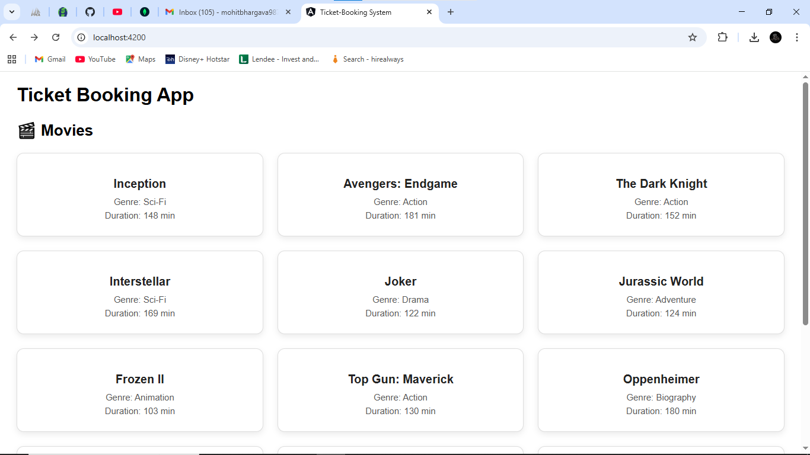
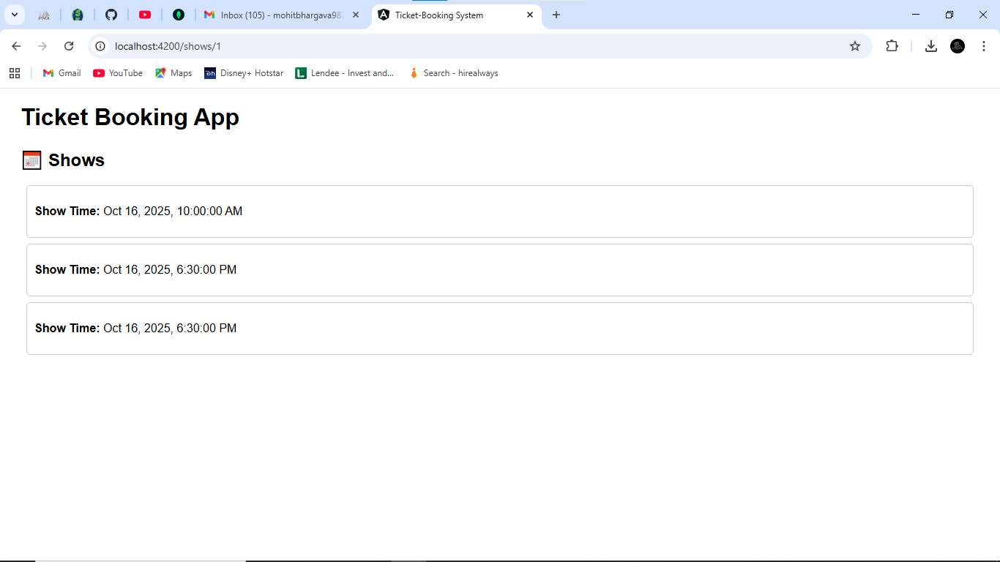
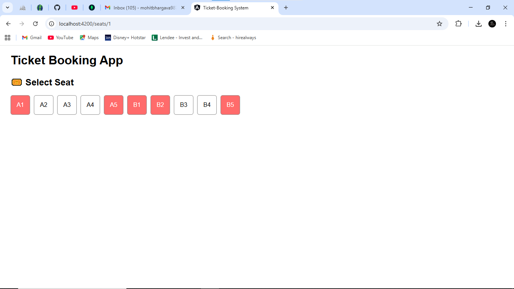

# Ticket Booking System (Production Branch)

Welcome to the **Ticket Booking System** repository! The branch (`production`) contains the stable and production-ready versions of both the **frontend** and **backend** projects.

---

## Repository Structure

.
├── frontend/ # Angular frontend project
├── backend/ # Node.js + Express backend project
├── README.md # This file
└── ...

---

## Prerequisites

Before running the project, ensure you have the following installed:

- **Node.js** (Angular 12 compatibility)
- **npm** (comes with Node.js)
- **Angular CLI** (for running the frontend)
- **MySQL** (if using the backend database locally)

---

## Getting Started

### 1. Clone the Repository

```bash
git clone -b production https://github.com/MohitBhargava987/MohitBhargava987-ticket-booking-16OCT.git
cd MohitBhargava987-ticket-booking-16OCT

2. Install Dependencies
Backend
cd backend
npm install


Make sure to check the backend README
 for API usage and CURL examples.

Frontend
cd ../frontend
npm install

3. Running the Project
Backend
cd backend
npm start


This will start the backend server (default port: 4040).

Frontend
cd frontend
ng serve


This will start the Angular frontend (default port: 4200).

Notes

This is the production branch: it is stable and ready to run without issues.

All API CURL commands and backend documentation are available in the backend folder README.




